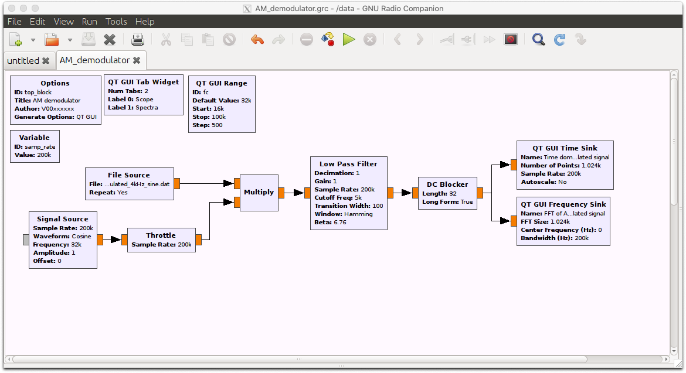
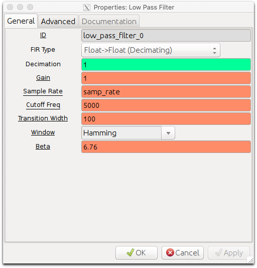
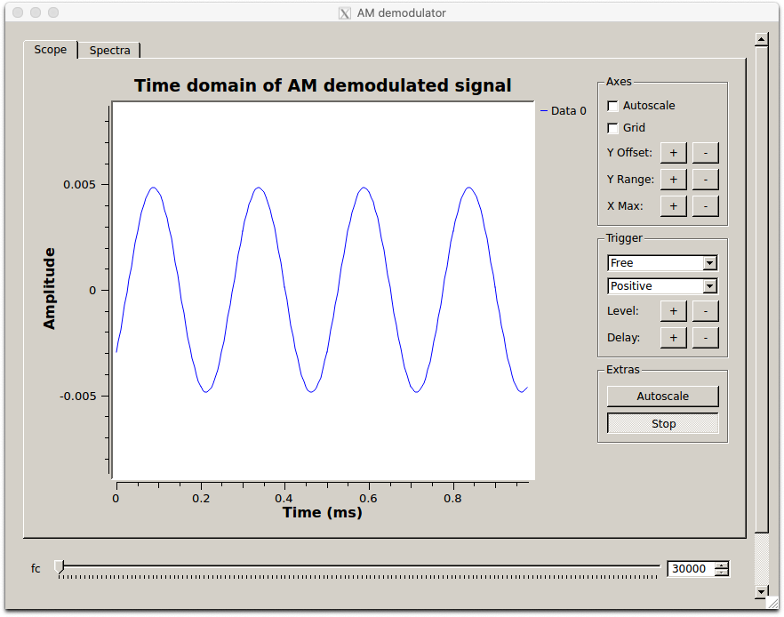
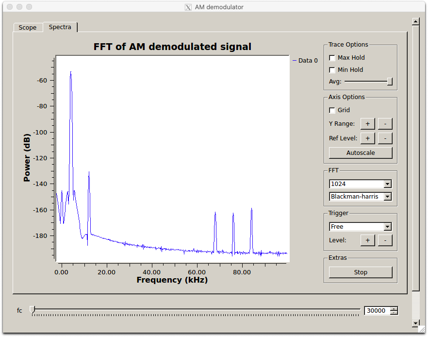

## Objectives

This part of the lab is a guide to building a practical AM receiver for receiving real AM signals. It all builds off of the last part (AM transmitters) and in it you will learn how to:

- demodulate one of the modulated AM signals from the last part using only real signals.

The second part addresses demodulating a provided data file which contains several seconds of recorded signals from the AM broadcast band. In this section you will learn how to:

- filter out the undesired signals using other (different) carrier frequencies
- demodulate the desired AM signal using complex signals
- tune to a specific (desired) AM signal on a given carrier frequency

---

## Part 2 Deliverables

- GRC file of AM receiver with AGC as described below.
- There is 1 question in this part of the lab. It is clearly indicated as they were in the last part.
  - The question requires approximately 1 line of writing and address concepts, not details. Answer the questions and submit a single page containing the answers to your TA at the end of the lab. This should build upon your answers to the two questions posed in the last part (AM transmitters).

---

## Building an AM receiver

- Review the [theory of AM receivers using real signals](../../_docs/pdriessen_textbook.pdf) (section 3.1).

- Begin a new GRC file, titled `AM_demodulator.grc`. This file will be one of your deliverables. In the *Options* block, set the following:

  - **Title:** AM demodulator
  - **Author:** V00xxxxxx, V00yyyyyy (where all of your student numbers are included)

- To recover the message from an AM modulated signal, we must first eliminate the effect of the carrier frequency by multiplying the received signal with the carrier waveform and low pass filtering it. This provides the baseband signal **1 + k_a * m(t)**. A DC blocker is then used to obtain **k_a * m(t)**.

- Build the following flowgraph in your `AM_demodulator.grc` file.

     
    __*AM Demodulation flowgraph*__

  - In the *File Source* block, select the `AM_modulated_4kHz_sine.dat` file that you made in the last part. Make sure that "Repeat" is set to "Yes" so that the data will loop and you will have a continuously playing signal.
  - Remembering that the frequency of the modulated signal was 4 kHz, set the cutoff frequency of the low pass filter to 5 kHz so that only the sinusoidal message is kept and higher frequency components are discarded. Set the other parameters as below.

     
    __*Low pass filter parameters*__

  - After the low pass filter, the signal is amplified. Use a *QT GUI Range* widget to control the amplification.

     
    __*Amplifier parameters*__

  - The decimation rate of the *Low Pass Filter* block is set to four. To recover the signal frequency, we use a *Rational Resampler* block to restore to original sampling rate.

     
    __*Rational resampler parameters*__

- Run the flowgraph and analyze the output. Is it what you expected? You can also look at the other `.dat` files of modulated signals to demodulate them. Just remember to adjust the low pass filter parameters based on the modulated signal properties.

     
    __*Demodulated 4 kHz sine message*__

     
    __*Demodulated 4 kHz sine message in the frequency domain*__

     
    __*Demodulated 4 kHz sine message in the positive frequency domain*__

## Building a complex signal receiver with channel selection (tuning)

- Review the [theory of AM receivers using complex signals](../../_docs/pdriessen_textbook.pdf) (section 3.2).

- Click on the link below to download the data file used in this section. Save it in a location that you can access later. This file was created using a USRP receiver.
  - [am_usrp710.dat](./data/am_usrp710.dat)

- Create a new flowgraph and title it `AM_demodulator_complex.grc`. This file will be one of your deliverables. In the *Options* block, set the following:

  - **Title:** Complex AM demodulator
  - **Author:** V00xxxxxx, V00yyyyyy (where all of your student numbers are included)

- Construct the flow graph shown below. Set the sample rate in the variable block to 256000. This is the rate at which the saved data was sampled.

     
    __*Flow graph to play a file to an FFT sink.*__

  - Double-click on the *File Source* block. Click on the ellipsis (...) next to the *File* entry box. Locate the `am_usrp710.dat` file that you saved in the previous step. The path to your file will appear in the block properties. Set the *Output Type* to *Complex*. The use of complex data to describe and process waveforms in SDR will be discussed in the next lab. Set *Repeat* to *Yes*. This will cause the data to repeat so that you have a continuously playing signal.

- Save and execute the flow graph. You should observe an FFT display similar to the one shown below. You may need to click on *Y Range* and *Ref Level* buttons to scale the output. The *Autoscale* button automates this somewhat.
  
     
    __*GUI chooser properties dialog.*__

  - Note the following:
  
    - This data was recorded with a USRP set to 710 kHz. Thus, the signal you see at the center (indicated as 0 kHz) is actually at 710 kHz. Similarly, the signal at 80 kHz is actually at 710 kHz + 80 kHz = 790 kHz.
    - The display spans a frequency range from just below -120 kHz to just above 120 kHz. This exact span is 256 kHz, which corresponds to the sample rate that the data was recorded at.
    - The peaks that you observe on this display correspond to the carriers for AM broadcast signals. You should also be able to observe the sidebands for the stronger waveforms.
  
  > To change the center frequency of the FFT, you can change the "Center Frequency" parameter in the *QT GUI Frequency Sink*.

### Frequency display resolution

In this step we will expand the frequency scale on the FFT display so that you can view the signals with greater resolution. Recall from the previous lab part on AM transmitters that the span of the frequency axis is determined by the sample rate (256 kHz for this file). While we cannot change the original data, we can resample it to either increase or decrease the sample rate. We will decrease the sample rate by using decimation. Modify the flow graph as follows:

- Add a *Variable* block (under *Variables* category). Set the ID to `resamp_factor` and the Value to 4.

- Add a *Rational Resampler* block. Set its decimation factor to `resamp_factor`. It will use this value to decimate the incoming data. That means that it will divide the incoming data rate by the decimation factor. In this example, the incoming 256000 samp/sec data will be converted down to 256 kHz/4 = 64000 samp/sec.

- Note that the *Throttle* and *QT GUI Frequency Sink* now need their sample rates changed to correspond to this new rate. Change the sample rate in both of these blocks to `samp_rate/resamp_factor`. Now we can change the decimation factor in the *Variable* block and it will be reflected in each of the other blocks automatically.

- Your flow graph should now appear as shown below.

     
    __*Flow graph with file input and decimated FFT sink output.*__

- Execute the new flow graph. You should now observe a frequency span of only 64 kHz (-32 kHz to +32 kHz).



### Selecting one channel by filtering

The bandwidth of an AM broadcast signal is 10 kHz (+/- 5 kHz from the carrier frequency). You may find it useful to click the *Stop* button on the FFT plot to see this more clearly.



In order to select the station at 710 kHz (0 kHz on the FFT display) we need to insert a filter to eliminate all but the one station that we want to receive. This is often referred to as a channel filter. Since the station at 710 kHz has been moved to 0 kHz (in the USRP) we will use a low pass filter. The station bandwidth is 10 kHz, so we will use a low pass filter that cuts off at 5 kHz.

- Insert a *Low Pass Filter* block between the *Rational Resampler* and the *Throttle*. Set the parameters as shown. Note that the "FIR Type" is now "Complex->Complex".

     
    __*Low pass filter properties dialog.*__

- Execute the flow graph. You should see that only the station between +/- 5 kHz remains.

### AM Demodulation

The next step is to demodulate the signal. In the case of AM, the baseband signal is the envelope or the magnitude of the modulated waveform. GNU Radio contains a *Complex to Mag* block (in the *Type Converters* category) that can be used for this purpose. Again, the use of complex signal representation will be dealt with in depth in the future.

- Insert the [Complex to Mag](https://wiki.gnuradio.org/index.php/Complex_to_Mag) block between the *Low Pass Filter* and the *Throttle*.



- Execute the flow graph. You should now observe the spectrum of the baseband signal.



### Matching the Audio Sample Rate

The next step is to listen to this demodulated waveform to confirm that it is in fact receiving the baseband signal.

- Remove the *Throttle* and the *Frequency Sink* Blocks.

- Add an *Audio Sink* block to the output of the *Complex to Mag* block. Set the sample rate of the *Audio Sink* to 48 kHz.

- Currently, the sample rate out of the *Complex to Mag* block is 64 kHz and the input to the *Audio Sink* is 48 kHz. In order to convert 64 kHz to 48 kHz we need to divide (decimate) by 4 and multiply (interpolate) by 3. Insert a *Rational Resampler* between the *Complex to Mag* and *Audio Sink* blocks and set the decimation and interpolation as appropriate. Also set its Type to *Float->Float (Real Taps)*.

- Since the output of the *Complex to Mag* is always positive, there will be a DC offset on the audio signal. The signal going to the audio hardware should not have any DC offset. Place a *DC Blocker* block between the *Complex to Mag* block and the *Rational Resampler* added in the previous step.

- Place a *QT GUI Time Sink* at the output of the *Rational Resampler* (in addition to the *Audio Sink*). Change its "Type" to "Float" and set its "Sample Rate" to 48000. The flow graph should be similar to the one shown below.

     
    __*Flow graph with file source with a "cleaner" audio output.*__

- Execute the flow graph. The *QT GUI Time Sink* should open and display the output waveform. However, you may not yet hear the audio from your speaker or it may be very distorted. This is due to the fact that the values of the samples going in to the *Audio Sink* block are outside the range expected by the *Audio Sink*. The *Audio Sink* requires that the sample values are between -1.0 and 1.0 in order to play them back through the audio hardware.

### Adding a Volume Control

- Insert a *Multiply Const* block between the *DC Blocker* and the *Rational Resampler*. Set the "IO Type" of the block to "Float".

- Add a *QT GUI Range* block. Set the parameters as shown.

     
    __*GUI slider properties dialog.*__

- Set the constant in the *Multiply Const* block to "volume" so that the slider controls it. The final flow graph is shown.

     
    __*Flow graph with a GUI volume control to resample and play audio.*__

- Execute the flow graph. You should now hear the demodulated AM signal. Stop the flowgraph.

- Double click on the *Low Pass Filter*. Note that it can also decimate. Change the decimation in the *Low Pass Filter* block to `resamp_factor` and set the sample rate back to `samp_rate`. Remove the *Rational Resampler* between the *File Source* and the *Low Pass Filter*. The filter now handles both operations. Test the receiver again.

### Tuning to a desired station (channel)

- Review the [theory of tuning to a radio station](../../_docs/pdriessen_textbook.pdf) (section 3.2.2).

- Place an *QT GUI Frequency Sink* at the output of the *File Source*, leaving the rest of the flow graph unchanged.

- Execute the flow graph and observe the location of the other stations in the spectrum. Note that there is a fairly strong signal at 80 kHz (what is really 710 + 80 = 790 kHz).

- In order to receive this signal we need to shift it down to zero frequency so that it will pass through the low pass filter. One way to accomplish this is to multiply it by a sinusoid. Modify the flow graph as shown below. Add a *Signal Source* block and set its parameters to output a cosine at a frequency of -80000. This negative frequency will shift the entire spectrum to the left by 80 kHz. Use a *Multiply* block and move the *QT GUI Frequency Sink* to observe its output. Test this receiver.

     
    __*Flow graph to play audio and with an FFT sink on the input.*__

- Add another *QT GUI Range* widget so that you can adjust the frequency with a slider. Set the minimum to `-samp_rate/2` and the maximum to `samp_rate/2`. Test your flow graph and demonstrate that it works. You may need to adjust your volume slider for each station. This is because the stations are at varying distances away from the receiver and have different transmitted power. (Remember the link equation?)

### Automatic Gain Control

The volume adjustment can be automated with an [Automatic Gain Control (AGC) block](https://wiki.gnuradio.org/index.php/AGC). This block works by sampling its own output and adjusting its gain to keep the average output at a particular level.

- Insert an *AGC* block between the *Low Pass Filter* and the *Complex to Mag* block. The *AGC* will adjust the gain so that the sample values are always in a suitable range for the audio hardware. Leave the parameters at their default values.

- You can now remove the *Multiply Const* block as well as the volume variable (set by the *QT GUI Range* widget). Test the receiver again. Adjust the volume to a comfortable level using the computer's volume control on the first station you hear. Now tune up and down the band and notice that you no longer need to adjust the volume, but the noise level increases for weaker stations. The radio functions the same as a hardware radio.

---

At this point, you should have:

- 4 GRC files
  - `waveform-builder.grc`
  - `AM_modulator.grc`
  - `AM_demodulator.grc`
  - `AM_demodulator_complex.grc`
- 9 data files
  - `AM_modulated_4kHz_sine.dat`
  - `square_waveform.dat`
  - `AM_modulated_square.dat`
  - `two_sines_waveform.dat`
  - `AM_modulated_two_sines.dat`
  - `prbs_rrc_waveform.dat`
  - `AM_modulated_prbs_rrc.dat`
  - `prbs_square_waveform.dat`
  - `AM_modulated_prbs_square.dat`

## Deliverables

From this part of the lab, keep the following files to submit to your TA:

- `AM_demodulator.grc`
- `AM_demodulator_complex.grc`.
- The answer to 1 deliverable question.

Combine these deliverables with those from the last part of the lab and submit them as a package. As your TA where to submit them, and remember to put your name and student number on everything (If you filled out the *Options* block in the `.grc` files correctly, your student numbers will be recorded in them.)

**Do not attach the `top_block.py` or `.dat` files.**
