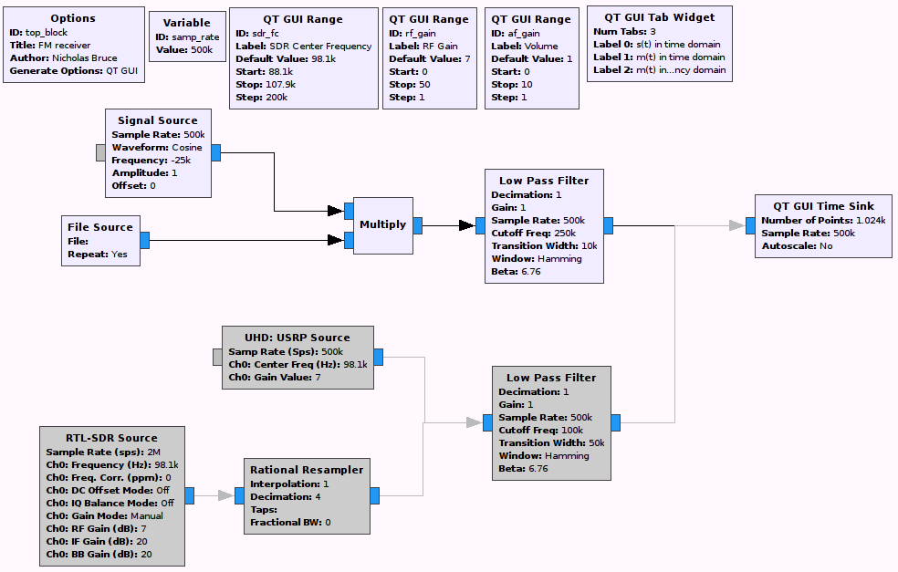
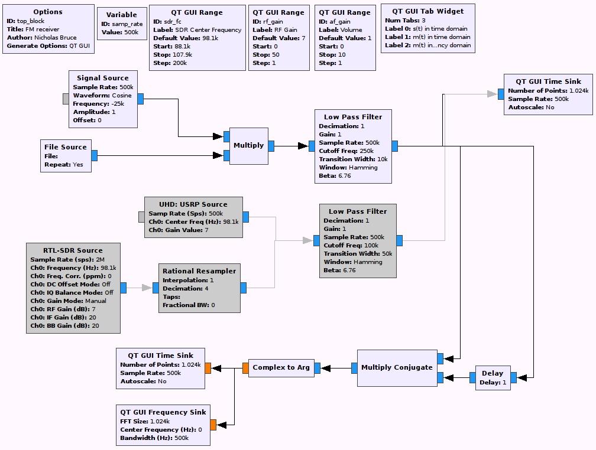
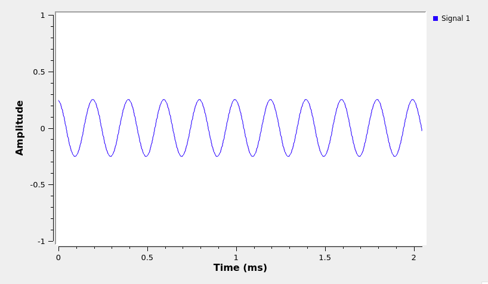
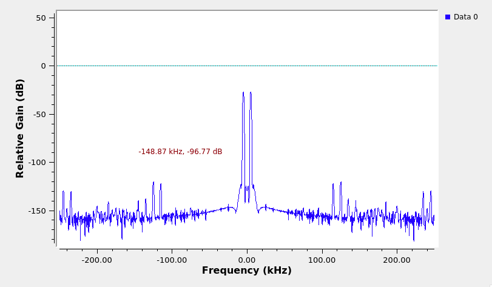
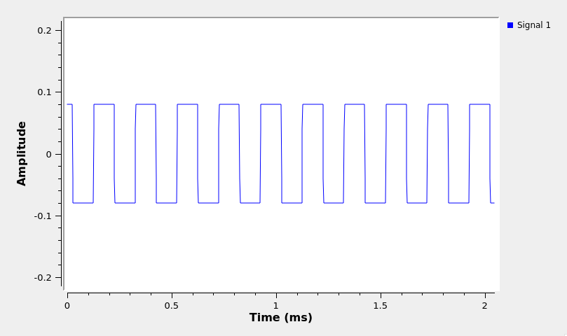
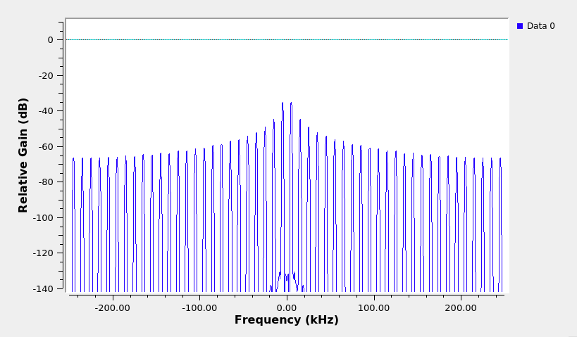
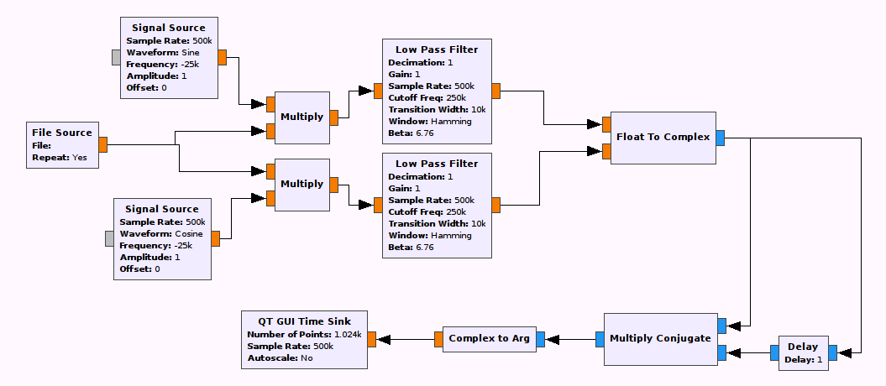

## Objectives

This part of the lab is a guide to receiving FM signal waveforms. You will:

- learn the theory and equations of FM signals, power spectra, bandwidths, and FM demodulation

- construct an FM receiver flowgraph to recover messages from an FM waveform

---

## Part 2 Deliverables

- One GRC files of an FM receiver. You will be stepped through building it.

---

## Theory

- Review the theory of [FM Signals](../../_docs/pdriessen_textbook.pdf) (section 5).
- Recall that a digital FM demodulator starts with the I and Q outputs of a general IQ receiver. For an FM signal,

    $$ s(t) = A_c cos \left( 2\pi f_c t + 2\pi k_f \int_{0}^{1} m(\alpha )d\alpha \right) $$

    $$ I(t) = A_c cos \left( 2\pi k_f \int_{0}^{1} m(\alpha )d\alpha \right) $$

    $$ Q(t) = A_c sin \left( 2\pi k_f \int_{0}^{1} m(\alpha )d\alpha \right) $$

- To extract $$ m(t) $$ from $$ I(t) $$ and $$ Q(t) $$, consider them as a complex signal.

  $$
  \begin{align*}
      s(t) &= Re \{ a(t) e^{j\phi (t)} e^{j2\pi f_c t} \} \\

      &= Re \{ [ I(t) + j Q(t) ] e^{j2\pi f_c t}\} \\

      &= Re \{ \tilde{s}(t) e^{j2\pi f_c t } \}
  \end{align*}
  $$

  where,
  
  $$
  \begin{align*}
      \tilde{s}(t) &= I(t) + jQ(t) \\
      &= a(t) e^{j\phi (t) }
  \end{align*}
  $$

- It can be shown that $$ m(t) $$ is obtained from the following formula:

  $$ m(t) = arg[ \tilde{s}(t-1) \tilde{s}^{*} (t) ] $$

  where,

  $$ (t-1) \rightarrow z^{-1} $$

  represents one sample delay.

  >**Proof**:
  >$$
  >\\
  >\begin{align*}
  >    arg[ \tilde{s}(t-1)\tilde{s}^{*} (t) ] &= arg[ a(t-1) e^{j\phi (t-1)} a(t)e^{-j\phi (t)} ] \\
  >    &= \phi (t-1)- \phi (t) \\
  >    &\approx \frac{d\phi}{dt} \\
  >    &\approx 2\pi k_f m(t) 
  >\end{align*}
  >$$

## Receiving a demodulating simulated FM signals

- To begin, download this [partially completed flowgraph](./data/Incomplete-FM-Receiver.grc).
  - The completed portion implements three sources:
    - a *RTL-SDR Source* and filter which are disabled,
    - a *USRP Source* and filter which are disabled,
    - a *File Source*, down conversion, and filter which are "enabled".
  - Each of these sources can be used and controlled with the same *QT GUI Range* parameters.
  - If you want to use the USRP or RTL-SDR as a source, disable the stream coming from the *File Source*. If you want to use the *File Source* stream, do the opposite.
  - **For now, leave the SDR streams disabled and the *File Source* stream enabled.**

The output of each stream is $$ \tilde{s}(t) $$.

Before you add or change anything, the flowgraph should look like the following figure. Note that the *Signal Source* used to remove the carrier from the signal is set **negative** 25000 kHz.

   
  __*Incomplete flowgraph for receiving FM signals*__

- Open the *File Source* block and point it at `FM_TX_5kHz_sine.dat`. Execute the flowgraph and check that the output at $$ \tilde{s}(t) $$ is as expected. It should look like a frequency modulated sine wave since that's what it is.

- Implement $$ m(t) = arg[ \tilde{s}(t-1) \tilde{s}^{*} (t) ] $$ from the [theory section](#theory) to extract the message from the baseband signal.
  - You will need a [Delay](https://wiki.gnuradio.org/index.php/Delay) block with the *Delay* property set to 1. This delays every sample that enters the block by 1 sample.
  - You will also need one of each a [Multiply Conjugate](https://wiki.gnuradio.org/index.php/Multiply_Conjugate) block and a [Complex to Arg](https://wiki.gnuradio.org/index.php/Complex_to_Arg) block.
  - **Try to do this without looking at the figure of the final flowgraph below. Interpret the math and implement it by using the mentioned blocks.**

- Add a **QT GUI Time Sink** and a **QT GUI Frequency Sink** to the output to view the demodulated message.
  - Set the *GUI Hint* parameter of the time sink to *tabs@1*.
  - Set the *GUI Hint* parameter of the frequency sink to *tabs@2*.

- The flowgraph should now look like the following figure.

   
  __*FM receiver flowgraph*__

- Execute the flowgraph. You should see the demodulated 2 kHz sine wave in the output spectrum and time scope.

   
  __*Demodulated sine message, $$ m(t) $$ in time domain*__

   
  __*Demodulated sine message, $$ m(t) $$ in frequency domain*__

- Switch the input file to be `FM_TX_5kHz_square.dat`. You should be able to read the `1010...` FSK sequence

   
  __*Demodulated FSK message, $$ m(t) $$ in time domain*__

   
  __*Demodulated FSK message, $$ m(t) $$ in frequency domain*__

- This flowgraph will be a deliverable. Save it as `FM_receiver.grc`, and in the *Options* block, set the following:

  - **Title:** FM receiver
  - **Author:** V00xxxxxx, V00yyyyyy (where all of your student numbers are included)

## Advantage of a complex receiver versus a real receiver

The receiver implemented above uses a complex signal for input. A real signal could be used instead but the flowgraph becomes much more complicated. The below flowgraph is equivalent to the one you implemented above.

   
  __*Real FM receiver which is far more complicated than the complex receiver.*__

---

At this point, you should have:

- one GRC file
  - `FM_receiver.grc`

## Deliverables

From this lab part, keep the following for later submission to your TA:

- `FM_receiver.grc`

**Do not attach the `top_block.py` or `.dat` files.**
