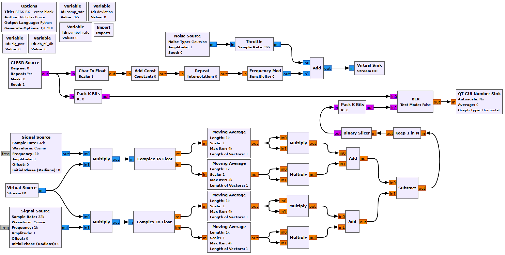

## Objectives

You will implement a non-coherent complex baseband FSK receiver to demodulate the transmitting signal chain previously built.

---

## Part 3 deliverables

For this section, the deliverables are:

- the answer to one deliverable question,
- a dataset for later use in this lab.

---

## Building the flowgraph

Construct the following GRC flowgraph. You can make a copy of the modulating flowgraph from the last section as a starting point by "Save As"-ing it.

  <br>
  __*Noncoherent BFSK simulation flowgraph*__

### Modulator

Keep the variables and the rest of the modulation chain unchanged. You can see that the *CumSum* and *Phase Mod* blocks have been replaced with a *Frequency Mod* block. [The documentation](https://wiki.gnuradio.org/index.php/Frequency_Mod) shows that this is an equivalent operation. For this reason you can opt not to replace it.

Set the `sig_pwr` variable appropriately. We saw in the last part of the lab that the modulated signal has an *amplitude* of 1.

### Noise Source

Remember that the *Amplitude* variable sets the noise standard deviation, $$\sigma$$. Use the following expression to set $$\sigma$$ using the `eb_n0_db` variable.

```python
math.sqrt( sig_pwr/ (10**(eb_n0_db/10)) * samp_rate/symbol_rate )
```

This is the same expression as from the theory but where $$\frac{E_b}{N_0}$$ is in units of dB.

### Virtual Sink & Virtual source

These blocks can be considered as connected by an "invisible" line on the flowgraph. They can be used for more complex tasks, but here they just keep the flowgraph from being criss-crossed with lines. They are also used to simulate a "transmitter" and "receiver". In this case the *Virtual Sink* transmits the noisy baseband waveform while the *Virtual Source* receives it.

Ensure that the *Stream ID* matches between the two.

### Receiver chain

This is a non-coherent receiver which is built from Sklar text figure 4.18 (below).

  <br>
  __*Non-coherent quadrature FSK receiver (Sklar. fig. 4.18).*__

Match the text figure with the flowgraph. Can you see that they're the same?

### Signal Sources

Rather than have 4 real multiplies, 2 complex multiplies will work (see in the above figure that each chain is multiplied with $$sin(\omega_i)$$ as well as $$cos(\omega_i)$$). Ensure that the upper signal source operates at $$f_c-f_{dev}$$ while the lower at $$f_c+f_{dev}$$ (if you reverse them you'll later need to reverse the order of the signal chains again before combining them).

Set the amplitude to $$\sqrt{\frac{2}{T}}$$ as in the text figure.

### Moving Average

This block takes the average of all signals in *Length* and then scales the result by *Scale*. So for a moving average, $$\textit{Scale}=\frac{1}{\textit{Length}}$$. In this case it is being used to take the integral so a normal sum will do. The integral needed is from 0 to $$T$$, the symbol time ($$\int_0^T). Set the *Length* appropriately and set the *Scale* to 1.

### Keep 1 in N

Use this block to decimate the square wave form back into a one-sample-per-symbol bipolar bitstream. The argument is the decimation rate.

### Binary Slicer

This block outputs a 0 for every negative input and a 1 for every positive output.

### Pack K Bits

Set *K* to 8. This is the packet byte size that the later *BER* block requires.

### BER

This computes the error between the two inputs. It outputs to log of the BER, so if it outputs a value of -2, the BER is $$10^{-2}=0.01$$.

Set *Test Mode* to False, which will mean the block immediately starts outputting results (as opposed to waiting for the error rate to stabilize first). While *Test Mode* is False, the other parameters don't do anything, so you can leave them as they are.

### QT GUI Number Sink

This will draw the output of the BER block on a number line. Set the maximum to 0 (since $$10^0=1$$ meaning that every bit is wrong) and the minumum to -7.

## Run the experiment

1. Run the flowgraph.
2. Record the BER at $$\frac{E_b}{N_0}$$ values of `[0, 2, 4, 6, 8, 10]`. You will need to kill the flowgraph each time you need to set a new value.
   - Plotting GUI sink values also eats computational power. While waiting for the BER values to stabilize you may wish to disable any unneeded QT GUI blocks.

At this point you should have recorded 6 BER values.



Review the [section deliverables](#part-3-deliverables) before moving on.
