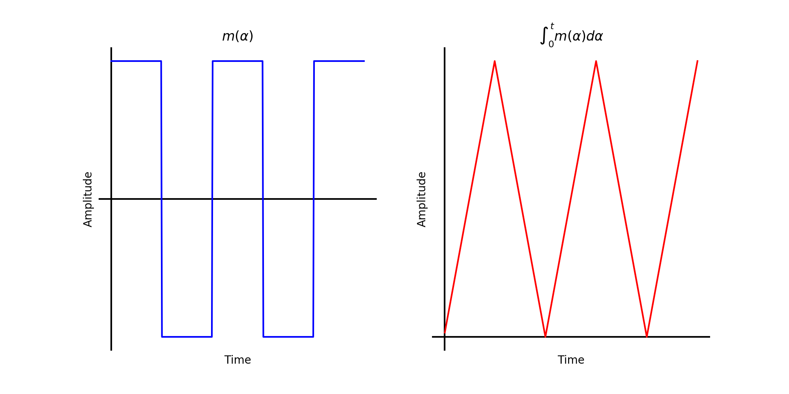
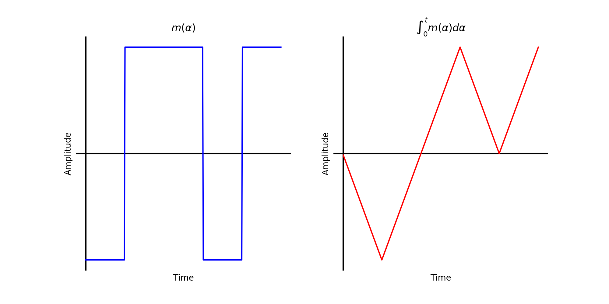
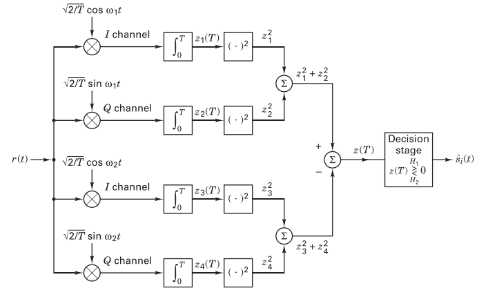

The theory for this lab is covered in the textbooks "Digital Communications: Fundamentals and Applications", 2nd edition, by Bernard Sklar [1], and "Signals and Modulations", by Peter Driessen [2] (the ECE350 textbook).

## 1.1 BFSK Modulation

_ECE350 text section 5.2, Sklar text section 4.2.3._ In BFSK modulation the binary message bits are each assigned a frequency which deviates by $$f_{dev}$$ from the carrier frequency, $$f_c$$. The two message frequency tones are then $$f_c \pm f_{dev}$$. A general expression for an FSK signal with carrier $$f_c$$, message $$m(\alpha)$$ and deviation $$f_{dev}$$ all sampled at $$f_s$$ is

$$
\begin{align}
  s(t) &= A_c cos\left[ 2\pi f_c t + \frac{2\pi f_{dev}}{f_s} \int^t_0 m(\alpha)d\alpha \right], \text{(real)} \\
  &= A_c e^{j2\pi f_c t} e^{\frac{j2\pi f_{dev}}{f_s} \int^t_0 m(\alpha)d\alpha}, \text{(complex)}.
\end{align}
$$

Thus the sampled complex baseband can be expressed as

$$
\tilde{s}(t) = e^{\frac{j2\pi f_{dev}}{f_s} \int^t_0 m(\alpha)d\alpha},
$$

which is the phase component of $$s(t)$$. Thus the phase of $$s(t)$$ is linearly proportional to the integral of the message, otherwise written that the derivative of the phase angle is linearly related to the message. Remembering that frequency is the time derivative of phase ($$f=\frac{d\phi}{dt}$$) it is clear that varying $$m(\alpha)$$ in the equation above will change the frequency of the signal and that a binary $$m(\alpha)$$ will yield two frequency tones.

### 1.1.1 $$\int_0^t m(\alpha)$$

Consider a binary bit stream `10101010...` and repeating each bit such that $$m(\alpha)$$ is a square wave signal is as below left. The integral is then below right. The ramps become the phase of the signal. Notice that in BFSK the absolute value of the slopes are equal, hence the two message frequencies deviating from $$f_c$$ by an equal amount.

   
  __*Square wave bitstream (left) and phase of modulated bitstream (right).*__

In the complex baseband this looks like the following figure

The same is true for a non-repeating bitstream as below. While the slope is constant and positive the modulated signal will be $$f_c + f_{dev}$$ and when the slope is constant and negative the modulated signal will be $$f_c - f_{dev}$$.

   
  __*Random bitstream with square pulses (left) and phase of modulated bitstream (right).*__



### 1.1.2 $$\tilde{s}(t)$$

Consider now the complex baseband of these signals below.

   
  __*Complex baseband of FSK square waveform message.*__

   
  __*Complex baseband of FSK square pulse-shaped bits.*__

Every time a bit changes, the frequency changes direction from $$+f_{dev}$$ to $$-f_{dev}$$. This is easier to visualize using the interactive helix graphics below.


  __*Complex baseband helixes of messages.*__

### 1.1.3 $$s(t)$$

When now multiplied with a carrier frequency the jump between the two message frequencies is easier seen. The real passband for the both the square wave are plotted below.

   
  __*Real passband of FSK square waveform message.*__

   
  __*Real passband of FSK square pulse-shaped bits.*__

Notice that the phase of the transmitted signal is continuous. The changes between the two frequency tones are smooth since the complex baseband also has no jumps in phase. The frequency is all that changes between bits.

## 1.2 FSK demodulation

### 1.2.1 Noncoherent FSK

_Sklar text section 4.5.3._ There are several ways to demodulate FSK without considering the phase of the signal. The figure below shows one method which will be implemented during the lab. It measures the energy of the received waveform and compares it to the known energies of the two tone frequencies ($$\pm f_{dev}$$). Notice that for each frequency the I and the Q channels are orthogonal and then summed after squaring. This ensures that no matter what the phase of the incoming signal is the summed result will will match the energy of the known frequency.

   
  __*Non-coherent quadrature FSK receiver (Sklar. fig. 4.18).*__

For a BFSK signal detected noncoherently, the minimum tone spacing is $$\frac{1}{T}=f_{sym}$$. This can be visualized as in the figure below where the zero-crossings of one tone must correspond with the peaks of the second tone. When discussing passband FSK the _frequency deviation_, being the offset from $$f_c$$, is discussed more than the minimum tone spacing. While the minimum tone spacing for noncoherent BFSK is $$f_{sym}$$, the frequency deviation is $$\frac{f_{sym}}{2}$$.

   
  __*Minimum tone spacing for noncoherently detected FSK (Sklar. fig. 4.20).*__

### 1.2.2 Coherent FSK

_Sklar text section 4.4.4._ Remembering that an FSK signal can be expressed as

$$
s_i(t) = \sqrt{\frac{2E}{T}}cos\left( \omega_i t + \phi \right), \text{(Sklar text eqn. 4.8)}
$$

the input bits $$a_{ij}$$ can be recovered by correlating the signal with their known modulation frequencies $$\omega_{ij}$$.

$$
a_{ij} = \int^T_0 \sqrt{\frac{2E}{T}}cos\left(\omega_i t \right) \sqrt{\frac{2}{T}}cos\left(\omega_j t \right) dt, \text{(Sklar text eqn. 4.38)}
$$

Where $$i=j$$ the correlator output is $$\sqrt{E}$$ (assuming the amplitude is normalized with the $$\frac{1}{\sqrt{\frac{2}{T}}}$$ term). When $$i \neq j$$ the correlator output is 0.

## 1.3 Theoretical BER

### 1.3.1 Noncoherent FSK

_Sklar text section 4.7.4._ The theoretical probability of a bit error for a binary orthogonal non-coherent FSK simulation is

$$
P_B = \frac{1}{2}e^{-\frac{E_b}{2N_0}}, \text{(Sklar text eqn. 4.96)}.
$$

The $$\frac{E_b}{N_0}$$ value can be expressed in the same way as [Lab 2]({{site.baseurl}}),

$$
\frac{E_b}{N_0} = \frac{a_i^2}{\sigma_0^2}\frac{W}{R}, \text{(all linear terms)}.
$$

Remember that in Lab 2 the simulation was real, not complex. In the real case, $$\frac{W}{R} = \frac{1}{2}\frac{f_s}{f_{sym}}$$ since the channel bandwidth is half of the receiver sample rate. In the complex case, $$\frac{W}{R}=\frac{f_s}{f_{sym}}$$.

### 1.3.2 Coherent FSK

_Sklar text section 4.7.3._ The probability of a bit error for coherent detection of binary orthogonal FSK is

$$
P_B = Q\left( \sqrt{\frac{E_b}{N_0}} \right), \text{(Sklar text eqn. 4.82)}.
$$

In this case the use of a matched filter guarantees the expression

$$
\frac{E_b}{N_0} = \frac{a_i^2}{\sigma_0^2} \frac{W}{R}, \text{(all linear terms)}.
$$

## 1.4 Theory summary

1. FSK modulation assigns each input bit value a distinct frequency.
2. Demodulation can be done coherently or non-coherently.
3. When noncoherently demodulated, the signal can be transmitted with a tone spacing of $$\frac{1}{T}$$.
4. When noncoherently demodulated, the signal can be transmitted with a tone spacing of $$\frac{1}{2T}$$.

**It may help to review the code used to generate these figures. They can be found at:**

- [theory-figures.py](./data/theory-figures.py)
- [theory-figures-interactive.py](./data/theory-figures-interactive.py)

## References

[1] Sklar, B., & Ray, P. K. (2013). Digital Communications: Fundamentals and Applications (2nd ed.). Pearson. https://doi.org/10.1201/9781420049763.ch70
[2] Driessen, P. (2015). Signals and Modulation.
