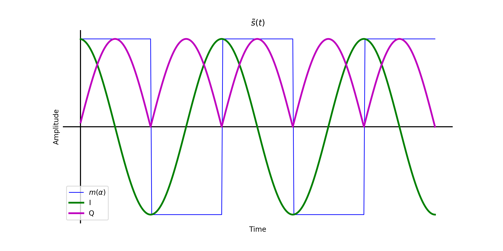
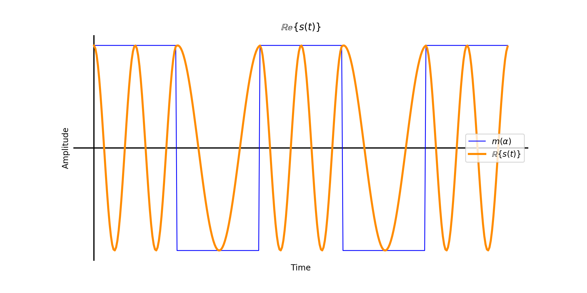
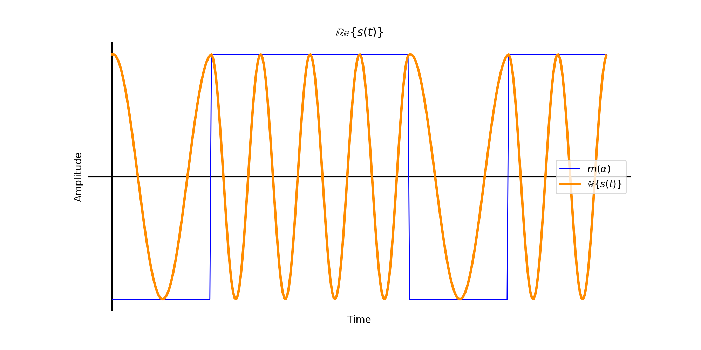

The theory for this lab is covered in the textbooks "Digital Communications: Fundamentals and Applications", 2nd edition, by Bernard Sklar [1], and "Signals and Modulations", by Peter Driessen [2] (the ECE350 textbook).

## 1.1 BFSK Modulation

_ECE350 text section 5.2, Sklar text section 4.2.3._ In BFSK modulation the binary message bits are each assigned a frequency which deviates by $$f_{dev}$$ from the carrier frequency, $$f_c$$. The two message frequency tones are then $$f_c \pm f_{dev}$$. A general expression for an FSK signal with carrier $$f_c$$, message $$m(\alpha)$$ and deviation $$f_{dev}$$ all sampled at $$f_s$$ is

$$
\begin{align}
  s(t) &= A_c cos\left[ 2\pi f_c t + \frac{2\pi f_{dev}}{f_s} \int^t_0 m(\alpha)d\alpha \right], \text{(real)} \\
  &= A_c e^{j2\pi f_c t} e^{\frac{j2\pi f_{dev}}{f_s} \int^t_0 m(\alpha)d\alpha}, \text{(complex)}.
\end{align}
$$

Thus the sampled complex baseband can be expressed as

$$
\tilde{s}(t) = e^{\frac{j2\pi f_{dev}}{f_s} \int^t_0 m(\alpha)d\alpha},
$$

which is the phase component of $$s(t)$$. Thus the phase of $$s(t)$$ is linearly proportional to the integral of the message, otherwise written that the derivative of the phase angle is linearly related to the message. Remembering that frequency is the time derivative of phase ($$f=\frac{d\phi}{dt}$$) it is clear that varying $$m(\alpha)$$ in the equation above will change the frequency of the signal and that a binary $$m(\alpha)$$ will yield two frequency tones.

### 1.1.1 $$\int_0^t m(\alpha)$$

Consider a binary bit stream `10101010...` and repeating each bit such that $$m(\alpha)$$ is a square wave signal is as below left. The integral is then below right. The ramps become the phase of the signal. Notice that in BFSK the absolute value of the slopes are equal, hence the two message frequencies deviating from $$f_c$$ by an equal amount.

  !m-alpha-square-wave.png](figures/m-alpha-square-wave.png) 
  __*Square wave bitstream (left) and phase of modulated bitstream (right).*__

In the complex baseband this looks like the following figure

The same is true for a non-repeating bitstream as below. While the slope is constant and positive the modulated signal will be $$f_c + f_{dev}$$ and when the slope is constant and negative the modulated signal will be $$f_c - f_{dev}$$.

   
  __*Random bitstream with square pulses (left) and phase of modulated bitstream (right).*__

### 1.1.2 $$\tilde{s}(t)$$

Consider now the complex baseband of these signals below.

   
  __*Complex baseband of FSK square waveform message.*__

   
  __*Complex baseband of FSK square pulse-shaped bits.*__

Every time a bit changes, the frequency changes direction from $$+f_{dev}$$ to $$-f_{dev}$$.

### 1.1.3 $$s(t)$$

When now multiplied with a carrier frequency the jump between the two message frequencies is easier seen. The real passband for the both the square wave are plotted below.

   
  __*Real passband of FSK square waveform message.*__

   
  __*Real passband of FSK square pulse-shaped bits.*__

Notice that the phase of the transmitted signal is continuous. The changes between the two frequency tones are smooth since the complex baseband also has no jumps in phase. The frequency is all that changes between bits.

## 1.2 Non-coherent FSK demodulation

<!-- ## 1.5 Theory summary

Pulse shaping can be done in multiple ways. Above, three methods are considered:

1. Generate a pulse stream from a bit stream and LPF using a window that minimizes spectral leakage.
2. Generate a pulse stream from a bit stream and filter using a window that has a zero-ISI characteristic.
3. Generate a pulse stream from a bit stream and filter using a window that has a zero-ISI characteristic when used at both the receiver and the transmitter.

During this lab you will experiment with the first and third options.

BER can be calculated by measuring the SNR of a BPSK signal. -->

## References

[1] Sklar, B., & Ray, P. K. (2013). Digital Communications: Fundamentals and Applications (2nd ed.). Pearson. https://doi.org/10.1201/9781420049763.ch70
[2] Driessen, P. (2015). Signals and Modulation.
