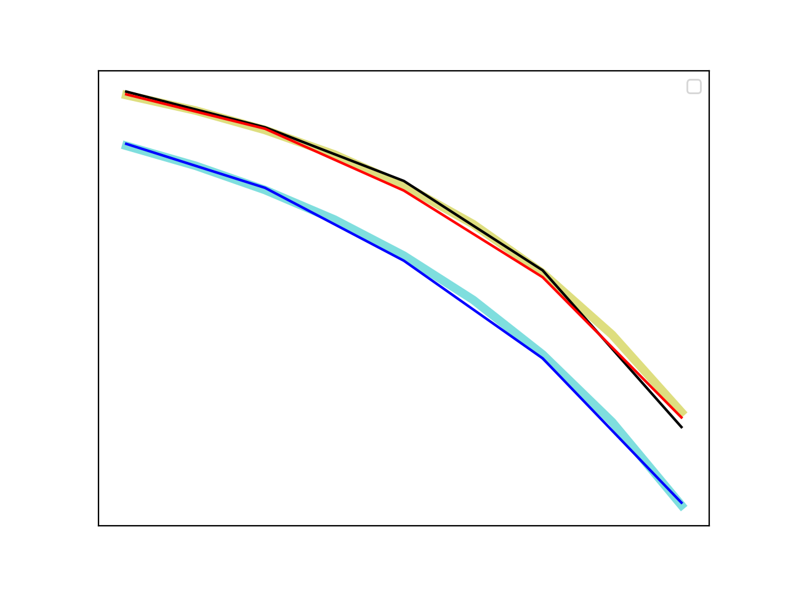

## Objectives

You will use the values recorded to plot a $$BER-\frac{E_b}{N_0}$$ curve for each of the noncoherent and coherent simulations and then compare them with theory.

---

## Part 5 deliverables

For this section, the deliverables are:

- the answer to two deliverable questions,
- the code used to generate the BER curve (with the dataset hard coded into it),
- the resulting BER curve as a .PNG image file.

---

## Generating a BER curve

Using the values collected throughout this lab you can now generate some $$BER-\frac{E_b}{N_0}$$ curve.

You can use a programming language of your choice, but python or matlab have some handy tools for this job built in.

Plot four curves on the same axes:

1. BER curve for the theoretical coherent BPSK,
2. BER curve for the simulated coherent BPSK,
3. BER curve for the theoretical noncoherent DPSK,
4. BER curve for the simulated noncoherent DPSK.

### Theory curves

For generating the curves of the theoretical $$BER-\frac{E_b}{N_0}$$ review [the theory section]({{ site.baseurl }}) of this lab. For the Q-function, Matlab ships with [`qfunc()`](https://www.mathworks.com/help/comm/ref/qfunc.html) while python has [`norm.sf()`](https://docs.scipy.org/doc/scipy-0.19.1/reference/generated/scipy.stats.norm.html) included in the scipy package.

### Simulation curves

You collected datasets of BER values for Eb/N0 values of 0, 2, 4, 6, 8 dB. Plot them against each other (remembering that $$BER=10^{-X}$$).

### Plotting details

Now that you have the four curves, ensure that the plot has:

- a log scale on the y-axis
- a linear scale on the x-axis
- appropriate axes titles
- a legend (one entry for each of: "Coherent theory", "Coherent simulation", "Noncoherent theory", "Noncoherent simulation")

A sample of what the plot might look like is included below (with all the labelling elements removed).

   
  __*Sample BER curve.*__





Review the [section deliverables](#part-5-deliverables) beforing moving on.
