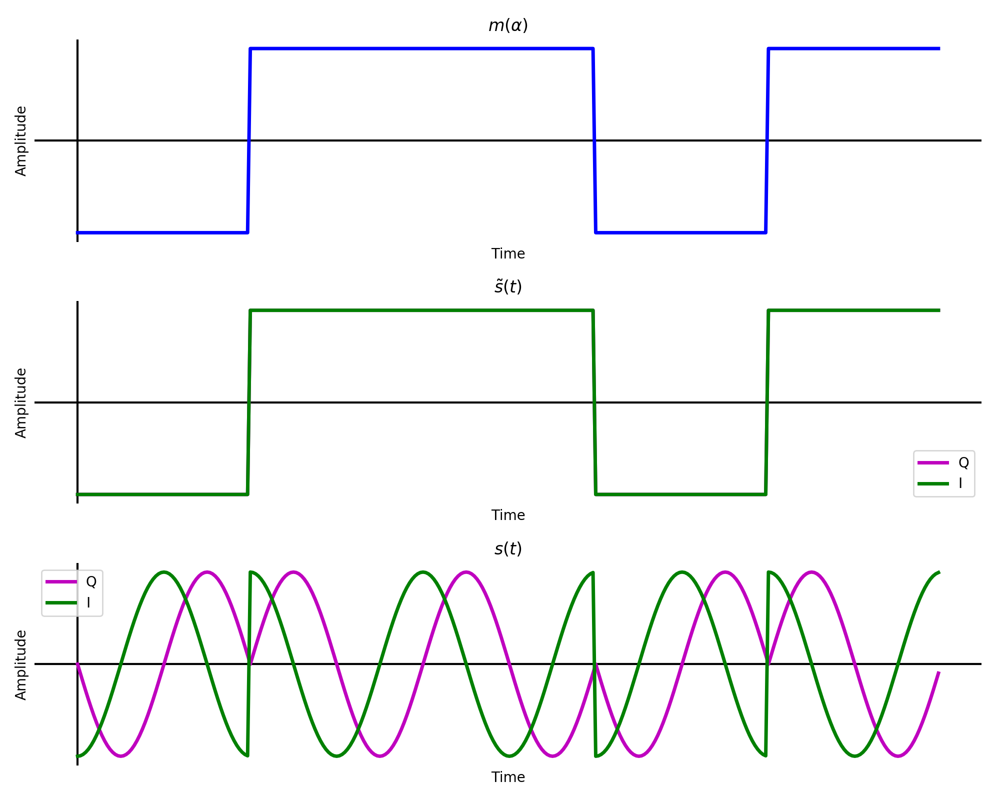
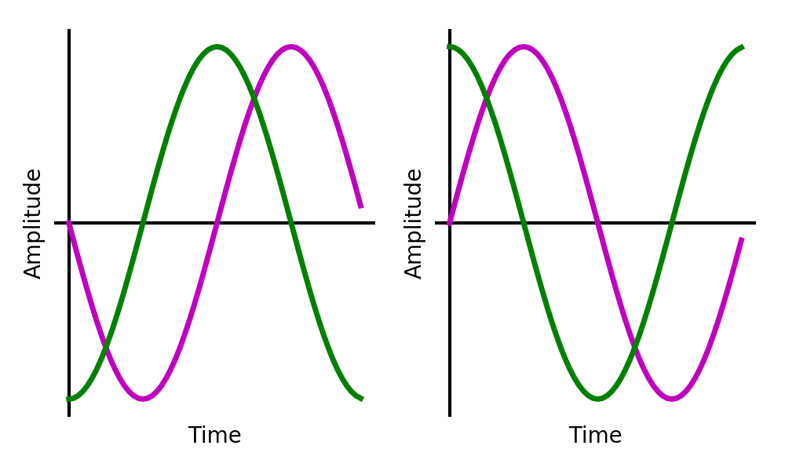
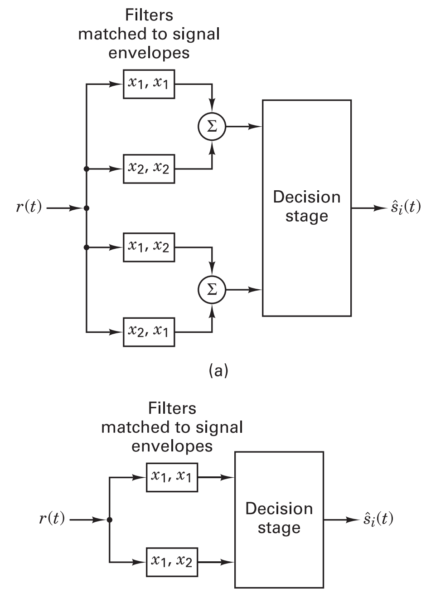
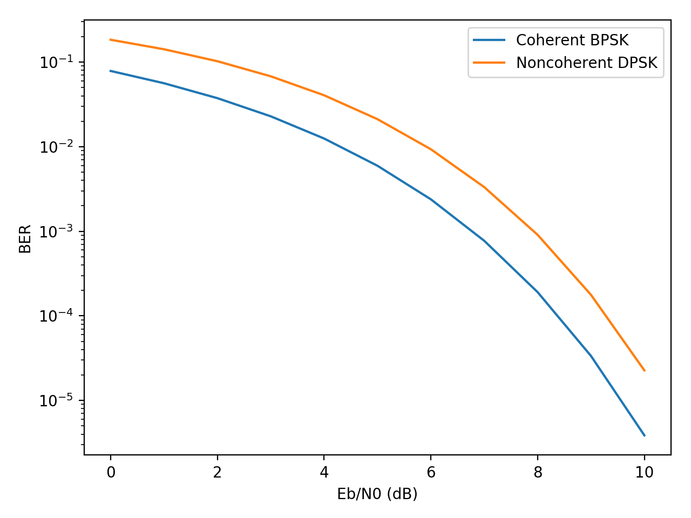

The theory for this lab is covered in the textbooks "Digital Communications: Fundamentals and Applications", 2nd edition, by Bernard Sklar [1], "Signals and Modulations", by Peter Driessen [2] (the ECE350 textbook), as well as the handwritten notes.

## 1.1 BPSK Modulation

### 1.1.1 Standard PSK Modulation

_ECE350 text section 7, Sklar text section 4.2.2._ In BPSK modulation, each bit is represented by a starting phase. A passband BPSK waveform will have a single frequency and an unchanging amplitude envelope. When the bits change there is a phase shift. Given a message (bitstream), $$m(\alpha)$$, a passband frequency, $$f_c$$, and a phase shift between bits, $$\phi$$, the passband BPSK waveform can be expressed as

$$
\begin{align}
s(t) &= \mathbb{Re}\left[ m(\alpha) e^\phi e^{2j\pi f_c t} \right]
&= \mathbb{Re}\left[ \tilde{s}(t) e^{2j\pi f_c t} \right]
\end{align}
$$

Notice that for PSK the complex baseband $$\tilde{s}(t)$$ is just the message multiplied with a phase shift.

$$
\tilde{s}(t) = m(\alpha)cos(\phi)+j*m(t)sin(\phi).
$$

For BPSK, $$\phi$$ can be set as $$\frac{\pi}{4}$$ which makes the imaginary and real components of $$\tilde{s}(t)$$ equal ($$\frac{1}{\sqrt{2}}$$). The waveform can then be scaled by $$\sqrt{2}$$ so that $$\tilde{s}(t)=m(\alpha)+j*m(\alpha)$$. This is illustrated below for the bitstream `[0, 1, 1, 0, 1]`.

   
  __*Message, complex baseband, and complex passband of square pulse shaped bits.*__

Notice that $$\mathbb{Im}\{\tilde{s}(t)\}$$ is hidden behind $$\mathbb{Re}\{\tilde{s}(t)\}$$ since they are identical. An interactive helix of the complex passband is below.


  __*Complex passband helix.*__

### 1.1.2 Differential PSK (DPSK) Modulation

_ECE350 text section 7.6.1, Sklar text section 4.5.1._ Another method of using phase information to modulate bits is differential encoding. Instead of each bit being assigned a starting phase, a phase shift is assigned to whether a bit changes or not. For example, taking the same bit stream from above `[0, 1, 1, 0, 1]` is differentially encoded as `[1, 1, 0, 1, 1, 0]`. The first `1` is arbitrary. From then on a `1` represents a change from the previously encoded bit to the next message bit while `0`'s represent no change.

Differential encoding is essential for PSK because the absolute phase of the received signal generally cannot be determined. However, one bit error in DPSK results in 2 bit errors after differential decoding.

## 1.2 BPSK Demodulation

### 1.2.1 Coherent BPSK

_Sklar text section 4.4.1._ As each bit is encoded with a starting phase, correlation taps can be made that match both possible bits. The received waveform is correlated with each possible bit and the result is the decoded bitstream.

   
  __*Taps for coherent a coherent BPSK receiver matching earlier waveform. `0` on left and `1` on right.*__

### 1.2.2 Noncoherent DPSK

_ECE350 text section 7.6, Sklar text sections 4.5.2, 4.7.5._ As the DPSK transmitter encoded every phase shift with a single bit. Considering every possible phase shift is between two bits, a similar receiver to the coherent BPSK receiver can be built with 4 arms of $$2T$$ taps each (see upper block diagram in the figure below). There will be one set of taps for each modulated bit sequence of `[0, 0]`, `[0, 1]`, `[1, 0]`, `[1, 1]`. Correlating the differentially encoded bitstream against these taps will deliver the decoded sequence.

Since $$corr($$`[1, 1]` $$,$$`[0, 0]` $$) = - corr($$`[1, 1]`$$,$$`[1, 1]`$$)$$, and $$corr($$`[1, 0]` $$,$$`[0, 1]` $$) = - corr($$`[0, 1]`$$,$$`[1, 0]`$$)$$, by comparing the magnitude of the correlation results the 4 taps receiver can be simplified to a 2 taps receiver (see lower block diagram in the figure below.

   
  __*Flow graph showing the 4 arm demodulator and the equivalent 2 arm demodulator (Sklar figure 4.26).*__

The taps for the two arms that match the earlier waveform are shown below.

   
  __*Taps for a noncoherent DPSK receiver matching earlier waveform. `[1, 1]` on left and `[1, 0]` on right.*__

There is another simpler DPSK demodulator shown in Sklar text section 4.5.2. Shown below, it integrates every symbol period and compares it with the previous by delaying and multiplying.

   
  __*Block diagram for a noncoherent DPSK receiver (Sklar figure 4.17c).*__

## 1.3 Theoretical BER

### 1.3.1 Coherent BPSK

_Sklar text sectiion 4.7.1._ The probability of a bit error for coherent BPSK is the same as in [Lab 1]({{ site.baseurl }}),

$$
P_B = Q\left( \sqrt{\frac{2E_b}{N_0}} \right), \text{(Sklar eqn. 4.79.)}
$$

### 1.3.2 Noncoherent DPSK

_Sklar text section 4.7.2._ Noncoherent DPSK is expected to perform worse than coherent BPSK as bit errors will often appear in pairs, increasing the required $$\frac{E_b}{N_0}$$ by approximately 1 dB.

$$
P_B = \frac{1}{2}e^{-\frac{E_b}{N_0}}, \text{(Sklar eqn. 4.100.)}
$$

## 1.4 Theory summary

The two binary phase shift keying encoding and decoding schemes being investigated in this lab are

1. Coherent BPSK
2. Noncoherent DPSK (there are two of these to study)

The BER curves for these schemes is illustrated in the following figure.

   
  __*Theoretical BER curves for coherent BPSK and noncoherent DPSK.*__

**It may help to review the code used to generate these figures. They can be found at:**

- [theory-figures.py](./data/theory-figures.py)
- [theory-figures-interactive.py](./data/theory-figures-interactive.py)

## References

[1] Sklar, B., & Ray, P. K. (2013). Digital Communications: Fundamentals and Applications (2nd ed.). Pearson. https://doi.org/10.1201/9781420049763.ch70
[2] Driessen, P. (2015). Signals and Modulation.
